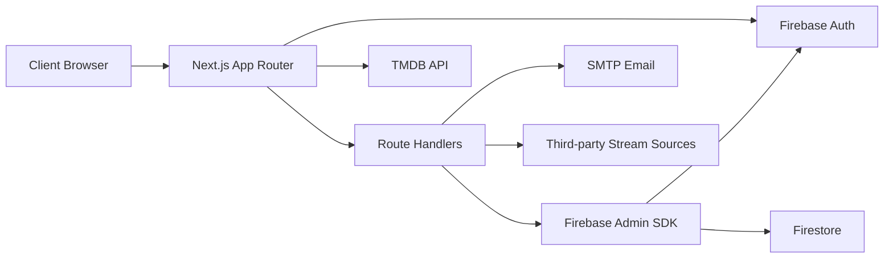
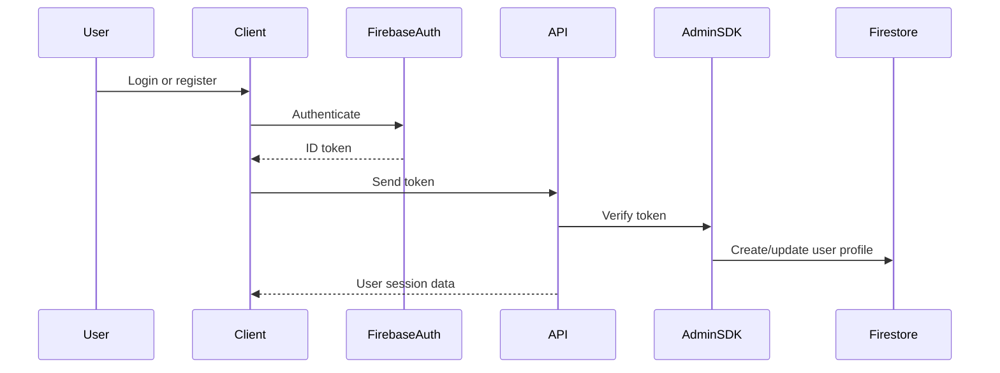
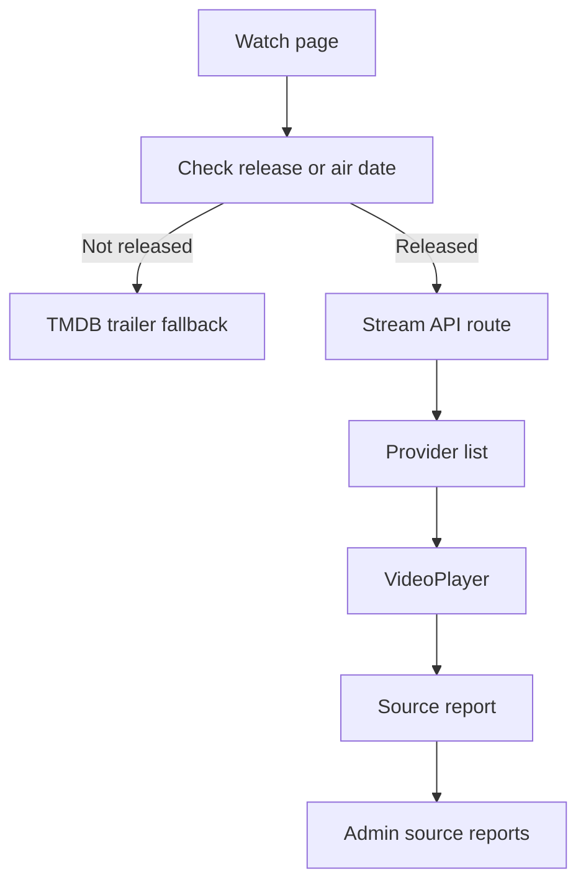
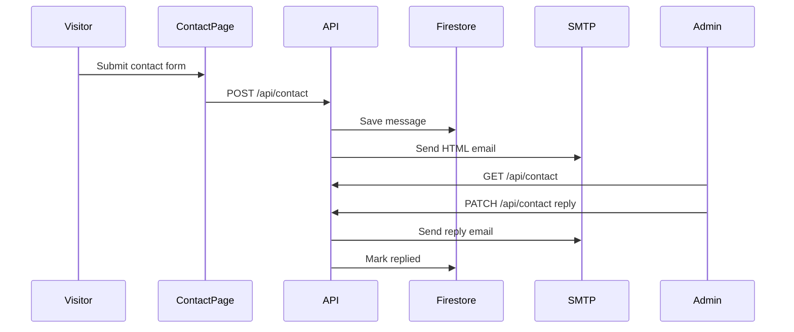

# CineHub Architecture

CineHub v2.1.0 is a Next.js App Router application with Firebase as the auth and data backbone. The app uses TMDB for public movie and TV metadata, Firestore for user/admin data, and server route handlers for secure writes and admin operations.

## High-Level Diagram

## Main Layers

| Layer | Responsibility |
| --- | --- |
| `src/app` | Pages, layouts, API route handlers, admin routes, watch routes. |
| `src/components` | Shared UI, auth forms, admin tables, movie/TV UI, watch player UI. |
| `src/hooks` | Client hooks for app behavior and auth. |
| `src/lib` | Firebase Admin, auth helpers, email, utility functions, app metadata. |
| `src/services` | TMDB fetch layer and media helpers. |
| `src/store` | Zustand stores for client state. |

## Authentication Architecture

CineHub uses Firebase Authentication.

Key points:

- MySQL and NextAuth are not used.
- Firebase ID tokens are verified server-side with Firebase Admin.
- Firestore stores profile, activity, watch, admin, and contact data.
- Admin pages use server-side checks before rendering protected data.

## Data Model Areas

Firestore is used for:

- Users and profiles
- Watchlist
- Watch history
- Favorites and favorite actors
- Ratings and reviews
- Admin activity logs
- Avatar metadata
- Source reports
- Contact messages

TMDB is used for:

- Movie details
- TV details
- Credits
- Images
- Videos and trailers
- Similar and trending content

## Watch Source Flow

The watch experience prioritizes correctness:

- Use TMDB IDs where possible.
- Prefer explicit providers before ambiguous title-based providers.
- Allow users to report broken or wrong sources.
- Use trailer fallback when content is unreleased.

## Contact Flow

## Admin Architecture

Admin features are server-backed:

- Dashboard metrics
- Analytics
- User management
- Avatar management
- Activity logs
- Source reports
- Contact messages

Admin pages read Firestore through Firebase Admin instead of trusting client-only data.

## Environment Boundaries

| Variable Type | Example | Exposed To Browser |
| --- | --- | --- |
| Public Firebase/TMDB | `NEXT_PUBLIC_FIREBASE_API_KEY` | Yes |
| Firebase Admin | `FIREBASE_PRIVATE_KEY` | No |
| Contact SMTP | `SMTP_PASS` | No |
| Admin config | `ADMIN_EMAIL` | No |

## Security Notes

- Keep server secrets out of Git.
- Use Vercel Sensitive environment variables for private values.
- Protect `/admin` with server-side Firebase Admin checks.
- Keep Firestore rules aligned with app behavior.
- Validate route handler input before writing to Firestore.

## Current Version Focus

Version 2.1.0 focuses on:

- Firebase-only auth and data flow.
- Firestore-backed user features.
- Real admin workflows.
- Source reporting.
- Trailer fallback.
- Unreleased-title trailer actions from detail pages.
- More realistic watch history and TV episode resume behavior.
- Server-side contact email.
- Vercel deployment reliability.
