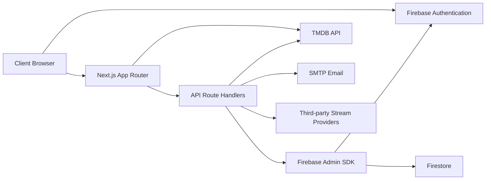
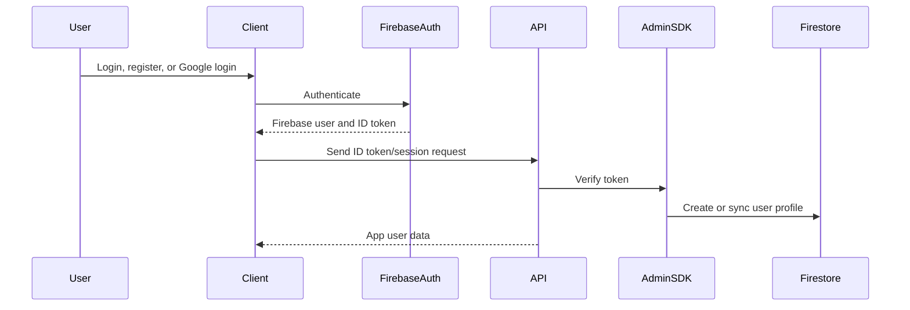
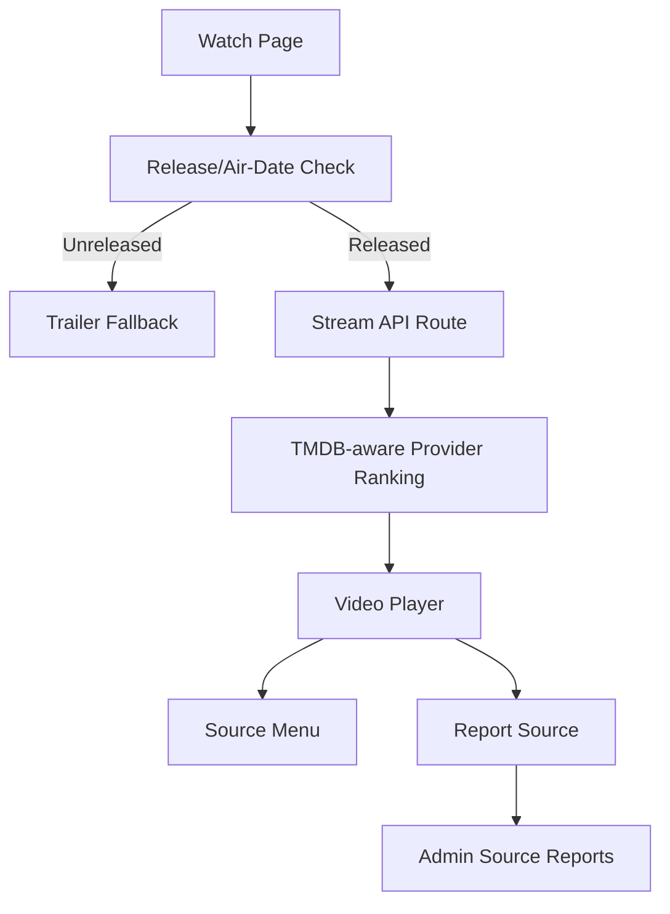
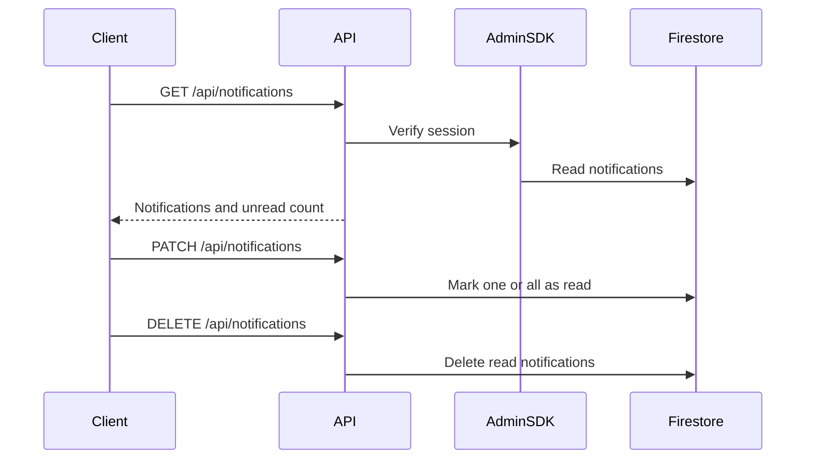
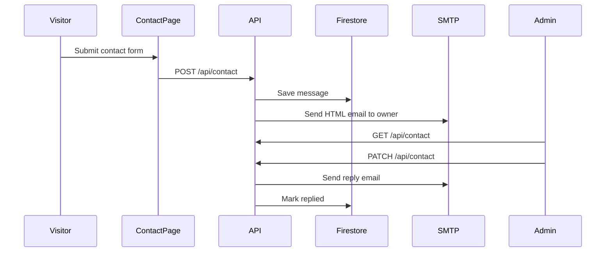
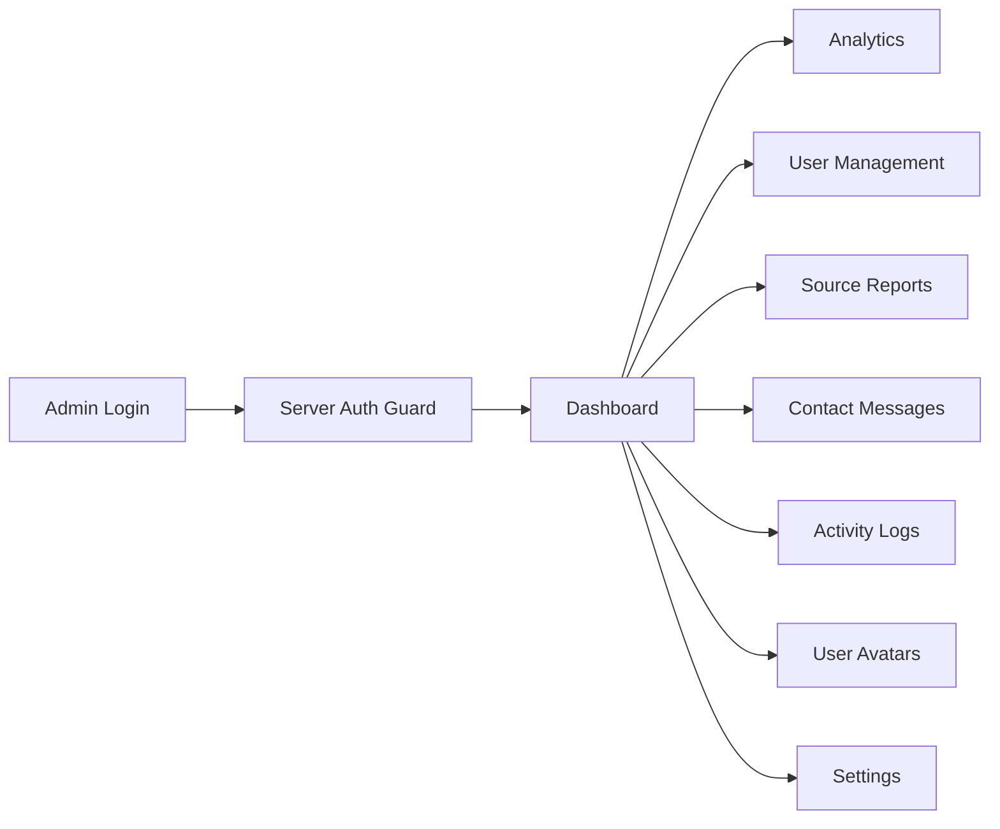

# CineHub Architecture

CineHub v2.11.0 is a Next.js App Router application with Firebase as the authentication and data backbone. TMDB provides public movie and TV metadata, Firestore stores user/admin data, and route handlers protect server-side writes and operational workflows.

## High-Level System

## Main Layers

| Layer | Responsibility |
| --- | --- |
| `src/app` | App Router pages, layouts, metadata, sitemap, robots, API route handlers. |
| `src/components` | Shared UI plus movie, TV, actor, auth, watch, profile, contact, and admin components. |
| `src/hooks` | Client workflow hooks for auth, history, recommendations, and shared behavior. |
| `src/lib` | Firebase client/admin setup, auth helpers, email, notifications, app metadata, utilities. |
| `src/services` | TMDB fetch layer, fallbacks, search, details, videos, images, and discovery helpers. |
| `src/store` | Zustand stores for client-side app state. |
| `src/types` | Shared TypeScript contracts for TMDB, user, media, and app data. |
| `public` | Logo, static images, and bundled user avatar assets. |

## Authentication Flow

Key rules:

- Firebase Authentication is the source of truth for auth.
- Firebase Admin verifies server-side tokens.
- Firestore stores app-specific profile and activity data.
- MySQL, NextAuth, and legacy JWT auth are not used.
- Admin pages must be protected by server-side checks.

## Firestore Data Areas

Firestore stores these app domains:

| Domain | Purpose |
| --- | --- |
| Users/profiles | Public profile, role, avatar, provider, account metadata. |
| Watchlist | Saved movies and TV shows. |
| Watch history | Watched items, resume data, episode labels, progress hints. |
| Ratings/reviews | User ratings and review data. |
| Favorite actors | Actor favorites for profile and actor detail flows. |
| Notifications | Header bell events, read/unread state, source labels, links. |
| Source reports | Broken/wrong/slow/quality source reports from the player. |
| Contact messages | Public contact form submissions and admin replies. |
| Admin logs | Operational activity logs and audit context. |
| Avatars | Built-in and uploaded avatar metadata. |

## TMDB Data Flow

TMDB provides public media metadata:

- trending, popular, top-rated, upcoming, and on-air lists
- movie and TV details
- actor/person detail and combined credits
- seasons and episodes
- credits and cast
- trailers and videos
- images
- reviews
- similar content
- search results

The service layer should fail softly where possible so the app can keep rendering useful UI even if a TMDB request fails.

## Watch Source Flow

Playback principles:

- Prefer providers that accept TMDB IDs.
- Use IMDb IDs when available to reduce wrong-title matches.
- Deprioritize sources with active reports.
- Show trailer mode for unreleased titles when TMDB has a trailer.
- Keep source reporting available from the player.

## Notification Flow

Notification events can come from watchlist activity, source reports, contact workflows, admin events, or system messages.

## Contact Flow

## Admin Flow

Admin starts at Dashboard because it gives the fastest operational overview. From there, the admin can move into analytics or direct work queues.

Admin pages should:

- read through server-backed APIs where sensitive data is involved
- paginate long lists
- avoid horizontal overflow
- keep mobile/tablet layouts usable
- expose clear review actions for reports and messages

## SEO And Portfolio Layer

CineHub includes portfolio-friendly SEO support:

- App Router metadata
- `sitemap.ts`
- `robots.ts`
- public app description
- footer portfolio link
- project docs and README

Keep `NEXT_PUBLIC_APP_URL` accurate in production so metadata, sitemap, and robots use the right domain.

## Environment Boundaries

| Variable Type | Example | Exposed To Browser |
| --- | --- | --- |
| Public Firebase | `NEXT_PUBLIC_FIREBASE_API_KEY` | Yes |
| Public TMDB | `NEXT_PUBLIC_TMDB_API_KEY` | Yes |
| Firebase Admin | `FIREBASE_PRIVATE_KEY` | No |
| Contact SMTP | `SMTP_PASS` | No |
| Admin config | `ADMIN_EMAIL` | No |

## Security Notes

- Keep `.env.local` out of Git.
- Use Vercel Sensitive variables for private values.
- Validate route handler input before Firestore writes.
- Keep Firestore rules aligned with frontend behavior.
- Protect admin pages and admin APIs with Firebase Admin checks.
- Never expose SMTP passwords or Firebase Admin keys in client components.

## Current Version Focus

Version 2.11.0 focuses on:

- smarter notification bell
- upgraded history
- profile stats and activity timeline
- movie/TV detail availability labels
- trailer-first media sections
- compact actor cards
- documented deployment and maintenance flows
